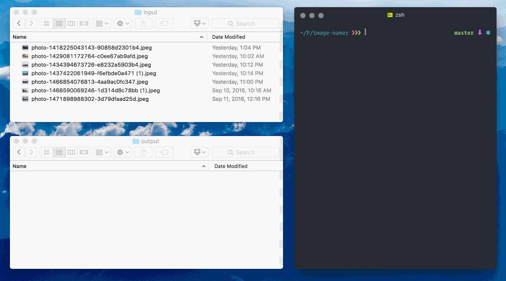

# :camera: Image Namer
> A node cli process to rename image files

### Goal
Provide an automated way of inspecting images and naming them something a bit more meaningful

### How it works
Image Namer will look in `./processing/input` for images. For each image it finds, it will detect features of the images and copy the image to `./processing/output` with a more readable name. 

### Demo

### Setup
> :battery: Batteries are not completely included in this due to the fact that the *Google Cloud Vision API* has quotas. 
  
  0. Head over to the [Vision docs](https://googlecloudplatform.github.io/google-cloud-node/#/docs/google-cloud/0.40.0/google-cloud?method=vision) and setup a Google Cloud project.
  0. Clone this repo
  0. Generate a `secrets.json` file and drop it into the root of this project
  0. Change https://github.com/cdonohue/image-namer/blob/master/main.js#L10 to be the name of your Google Cloud project

### Run it
  - `nvm use`
  - `npm install`
  - `npm start`
